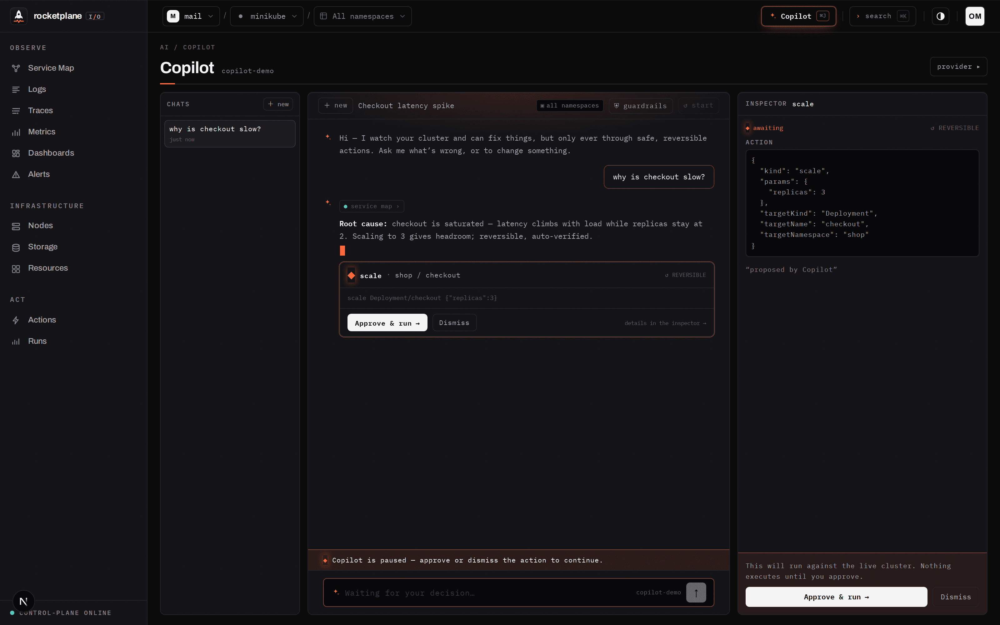
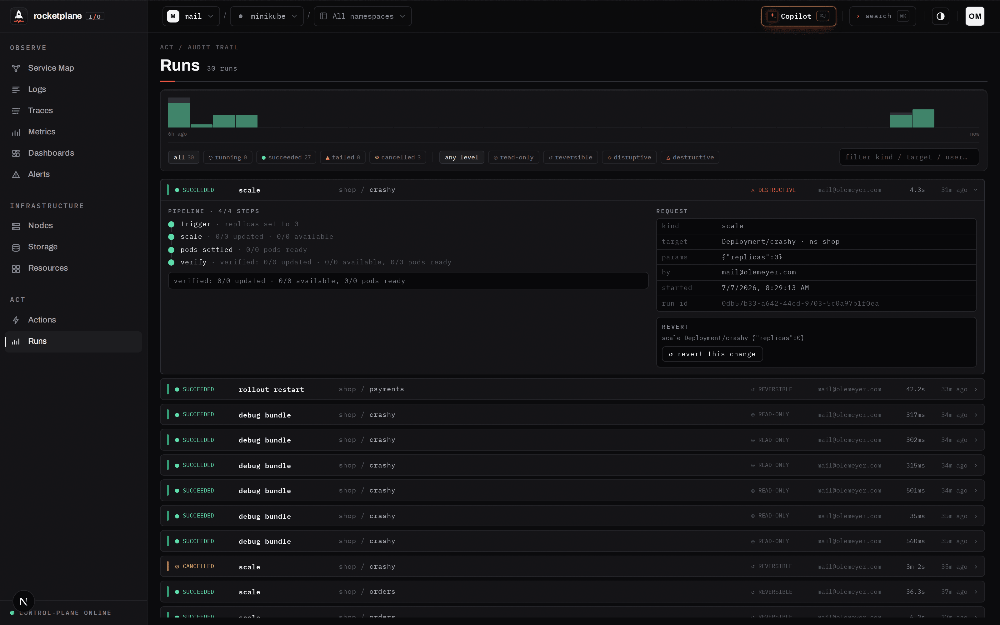

<div align="center">

<picture>
  <source media="(prefers-color-scheme: dark)" srcset=".github/assets/banner-dark.png">
  <source media="(prefers-color-scheme: light)" srcset=".github/assets/banner-light.png">
  
</picture>

<h2>An AI SRE for your Kubernetes cluster —<br>that can actually fix things, safely.</h2>

<p><b>Self-hosted · Apache-2.0 · bring your own LLM · air-gapped capable</b></p>


[](LICENSE)


[**Quick start**](#quick-start) · [**Is it safe?**](#is-it-safe) · [**Under the hood**](#under-the-hood)

</div>

<br>


<div align="center"><sub>You ask <i>“why is checkout slow?”</i>. The Copilot reads the service map and the logs itself,
names the root cause with evidence, and proposes <b>one</b> fix — which runs only after you approve it,
as a pipeline that verifies itself or rolls back.</sub></div>

<br>

> **Alpha.** The full loop works end-to-end today, developed against minikube. APIs and schemas
> still change without notice — don't point it at production yet.

## Three things you don't get anywhere else

### 1 · An AI SRE with a safety catalog — not an AI with kubectl

The Copilot investigates on its own: eBPF traces, logs, PromQL metrics, the live service map and
the **full Kubernetes inventory** (Services, Ingress, ConfigMaps, policies — everything). But it
can only change the cluster through **~30 named, reversible action pipelines**. No shell, no
`kubectl`, no YAML it could hallucinate.

Every action is risk-graded — and *you* set the approval rule per level:

| Level | Examples | Default approval |
|---|---|---|
| ◎ read-only | debug bundle, rollout history, drain preview | runs automatically |
| ↺ reversible | scale up, restart, set image, config edits | one click |
| ◇ disruptive | evict pod, rollout undo, cleanup | one click |
| △ destructive | drain, **scale-to-0**, NoExecute taint | **type the target's name to arm** |

Risk is parameter-aware (`scale replicas=3` is reversible; `replicas=0` is destructive), scope is
enforced server-side (a namespace-scoped session cannot touch nodes or other namespaces), and
every level can be set to `auto`, `click`, `confirm` or `off`.

**The model proposes. Deterministic pipelines execute, verify at pod level, and roll back.**
The LLM never touches the cluster directly.

Bring any Anthropic- or OpenAI-compatible model — including a fully local, air-gapped one. Your
telemetry never leaves your infrastructure either way.

### 2 · Traces for services you never instrumented

One outbound-only agent plus an eBPF DaemonSet
([OTel eBPF Instrumentation](https://github.com/grafana/beyla), née Grafana Beyla). HTTP/gRPC
spans **with cross-service context propagation — including compiled Go binaries** — plus SQL,
Redis and Kafka client spans. No SDKs, no sidecars, no code changes.


<div align="center"><sub>A real 500 on <code>GET /checkout</code>: the failure cascades frontdoor → checkout → catalog,
the exact ERROR log lines are correlated on the right. <b>No SDK in any of these services.</b>
An ERROR log line is two clicks away from this view. PromQL runs on the real Prometheus engine, embedded, on ClickHouse.</sub></div>

### 3 · Every change proves itself — or undoes itself

Actions aren't fire-and-forget `kubectl` calls. Each one is a pipeline —
**trigger → observe → verify** — that only reports success when the cluster actually converged:
old pods gone, new pods Ready, stable. Cancel, timeout or a failed verify triggers automatic
rollback from a snapshot taken *before* the mutation.


<div align="center"><sub><b>Runs</b> — the audit trail. Who ran what, the full step timeline, and
<b>↺ revert</b>: one click re-applies the exact state captured before the change. Cancel always
terminates — a reaper finalizes anything a dead agent leaves behind, and force-cancel never waits.</sub></div>

## Quick start

No published container images yet — you run the platform from source (that's the alpha part).
With Go 1.25+, Node 22+/pnpm and Docker installed:

```bash
git clone https://github.com/olemeyer/rocketplaneIO && cd rocketplaneIO

# 1 — data stores + OTLP collector (Postgres, ClickHouse — defaults just work)
docker compose -f deploy/compose/docker-compose.yml up -d

# 2 — control plane on :8090
go run ./services/controlplane/cmd/controlplane &

# 3 — web UI on :4173
pnpm install && pnpm dev
```

Open **http://localhost:4173**, create the owner account, hit **Connect cluster** — it hands you
one copy-paste `kubectl` command that installs the agent and the Beyla DaemonSet. When the service
map draws your namespaces and spans appear under Traces, you're live — without touching a line of
your code.

**Copilot:** open it from the top bar and connect any LLM provider — the key stays on your
instance, requests go straight from your control plane to the provider you chose.

**Demo workload:** a Python + Redis shop behind nginx that generates real traffic, errors and
slow queries — the workload every screenshot here was taken from:

```bash
kubectl apply -f deploy/dev/shop-realistic.yaml -f deploy/dev/frontdoor.yaml
```

> Alpha gap: the agent image isn't on a public registry yet. For a local minikube:
> `docker build -t rocketplane/agent:dev -f agent/Dockerfile . && minikube image load rocketplane/agent:dev`,
> then set `RP_AGENT_IMAGE=rocketplane/agent:dev` on the control plane.

## Is it safe?

The section every platform team reads first:

- **Outbound-only.** The agent dials out over HTTPS; nothing connects into your cluster, nothing
  listens. Actions are *claimed* by the agent — never pushed in.
- **Enumerated RBAC, two blocks** ([`deploy/install.yaml`](deploy/install.yaml)): *observe* is
  read-only; *act* holds exactly the write verbs the action catalog needs. Delete the act block
  (or set `rbac.actions=false` in Helm) for a strictly observe-only agent. No wildcards, no
  cluster-admin.
- **Secrets:** the inventory shows names, types and key counts — never values. That restraint is
  enforced in agent code; if you'd rather enforce it with RBAC too, delete the one `secrets` rule
  and the agent degrades gracefully.
- **The LLM is caged.** It reads through the same authenticated APIs you use, and mutates only
  via the whitelisted, validated, risk-gated action catalog. Every proposal, approval and result
  lands in the audit trail.
- **eBPF:** Beyla runs as a privileged DaemonSet (kernel ≥ 5.8 with BTF). The capture layer is
  upstream OpenTelemetry tooling — rocketplaneIO is the investigation-and-action loop on top.

## What else is in the box

<details>
<summary><b>Live service map · alerts with auto-remediation · PromQL on ClickHouse · full K8s inventory · Starlark workflows · more screens</b></summary>
<br>


<sub><b>Service map</b> — topology from real eBPF traffic flows; tech logos matched from container
images; live-updating.</sub>

<br><br>


<sub><b>Alerts</b> — typed checks or PromQL conditions with <code>for</code>-durations and
sparklines. A firing rule can dispatch a remediation workflow: once per transition, fully audited,
still subject to verify-or-rollback.</sub>

<br><br>


<sub><b>PromQL</b> — the actual Prometheus evaluation engine, embedded and pointed at ClickHouse
(<a href="services/controlplane/internal/promqlx">internal/promqlx</a>); editor built on
codemirror-promql. Custom metrics are named PromQL expressions, validated at save.</sub>

<br><br>


<sub><b>Resources</b> — the complete cluster inventory (Services, Ingress, ConfigMaps, batch,
policies, volumes, quotas), synced every 60s. The same data the Copilot reads via
<code>list_resources</code>.</sub>

<br><br>


<sub><b>Actions</b> — the catalog, searchable and risk-graded. Every built-in is also readable,
forkable <b>Starlark</b>: automate what an operator does by hand, with typed parameters that
render as forms. Deterministic, compiled at save.</sub>

<br><br>


<sub><b>Logs</b> — severity histogram, brushing, and the two-click path to the distributed
trace.</sub>

<br><br>


<sub><b>Nodes</b> — kubelet-level stats; cordon/drain are verified actions, with a read-only
<code>drain preview</code> that shows the blast radius first.</sub>

<br><br>

<sub>The UI follows a strict instrument-panel design system (RETICLE) — healthy is calm, only
anomalies speak.</sub>
</details>

## Under the hood

```
 YOUR CLUSTER   agent (Go, outbound-only, enumerated RBAC)      beyla eBPF DaemonSet
                topology · logs · inventory · action pipelines   HTTP/gRPC/Go · SQL/Redis/Kafka
                        │ HTTPS                                          │ OTLP
                        ▼                                                ▼
 CONTROL PLANE  control plane (Go, single binary)                OTel collector → ClickHouse
                API · auth/orgs · alert evaluator · action queue · Copilot loop
                embedded Prometheus engine (PromQL → ClickHouse) · SSE broker
                        │
 DATA           PostgreSQL (state, rules, runs, chats)  ·  ClickHouse (logs, traces, metrics)
 ACCESS         web (Next.js) — service map · copilot · logs · traces · metrics · alerts · actions · runs
```

The Copilot is a tool-calling loop inside the control plane: 16 read tools (logs, traces —
including single-trace waterfalls and trace↔log correlation — PromQL, service map, inventory,
debug bundles) plus exactly one mutating tool, `run_safe_action`, which pauses the stream for
human approval. The same toolbox is exposed as an [MCP server](services/controlplane/cmd/mcp),
so Claude Code or Cursor can operate your cluster through the identical guardrails.

<details>
<summary><b>Monorepo layout</b></summary>

```
├── agent/                      # in-cluster agent (Go): sync, logs, inventory, action pipelines + revert snapshots
├── services/controlplane/      # control plane (Go): API, auth, alerts, Copilot loop, PromQL engine
│   └── internal/
│       ├── api/                #   REST + SSE + copilot_* (loop, guardrails, approval gate)
│       ├── promqlx/            #   embedded Prometheus engine on ClickHouse
│       ├── alerts/ · telemetry/ · events/ · store/ · migrations/
│       └── ../cmd/mcp/         #   MCP server — same tools for external agents
├── apps/web/                   # Next.js UI (RETICLE design system)
└── deploy/                     # compose (dev stores), helm chart, install.yaml, demo shop
```
</details>

## Status

| Works end-to-end today | Not yet |
|---|---|
| Copilot: BYO-LLM investigation → guardrailed fixes | Published container images |
| eBPF traces incl. compiled Go, log→trace correlation | Hosted demo |
| ~30 safe actions with verify, rollback and revert | Measured overhead numbers |
| Runs audit trail, guaranteed-terminating cancel | Multi-user RBAC hardening |
| Alerts with auto-remediation dispatch | Server-side LLM key vault |
| PromQL + custom metrics on ClickHouse, full K8s inventory | |

## Contributing

Reports from real clusters are the contribution we want most —
[open an issue](https://github.com/olemeyer/rocketplaneIO/issues). See
[CONTRIBUTING.md](CONTRIBUTING.md). If this resonates, a star helps others find it.

## License

[Apache-2.0](LICENSE).

---

<div align="center">
<sub>Built with Go, Next.js, eBPF and ClickHouse · rocketplaneIO</sub>
</div>
