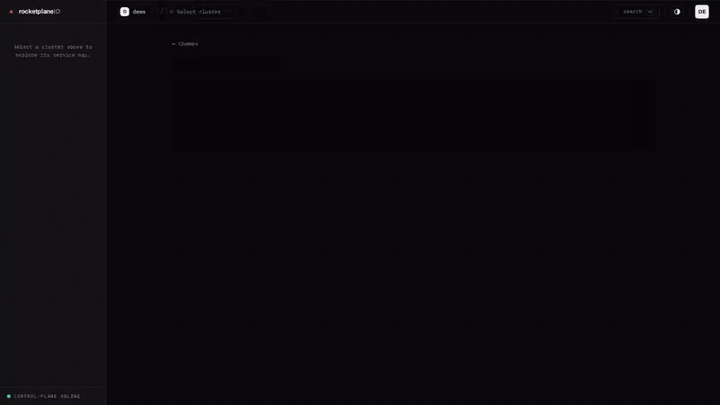
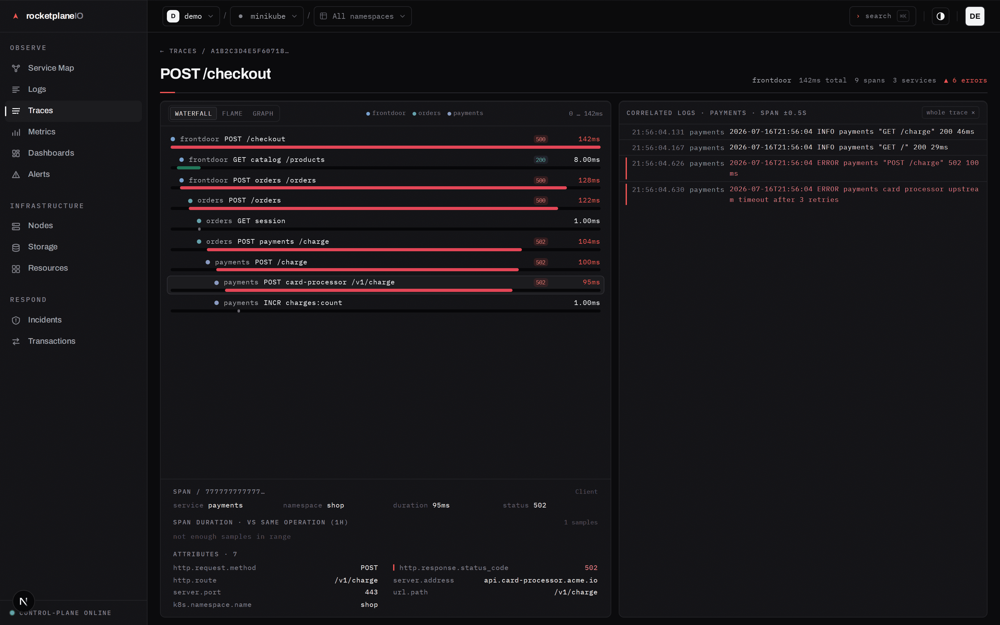
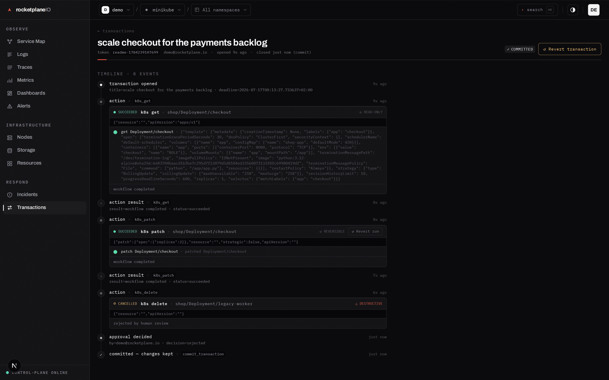
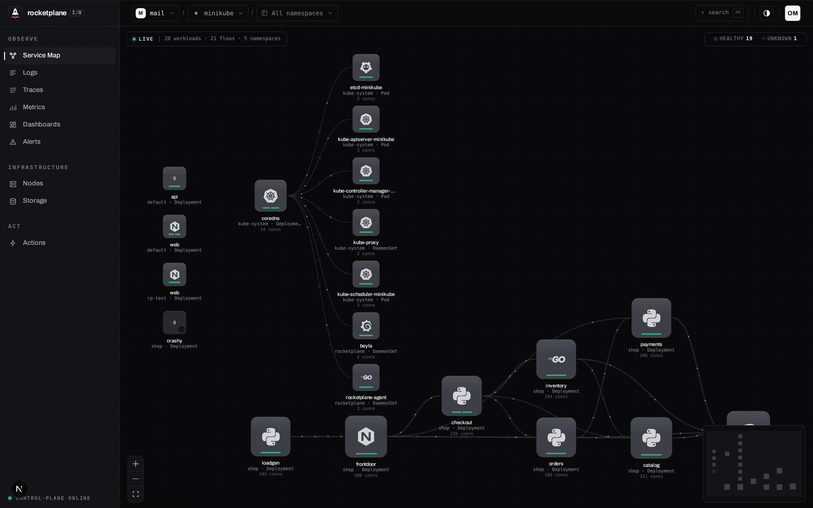
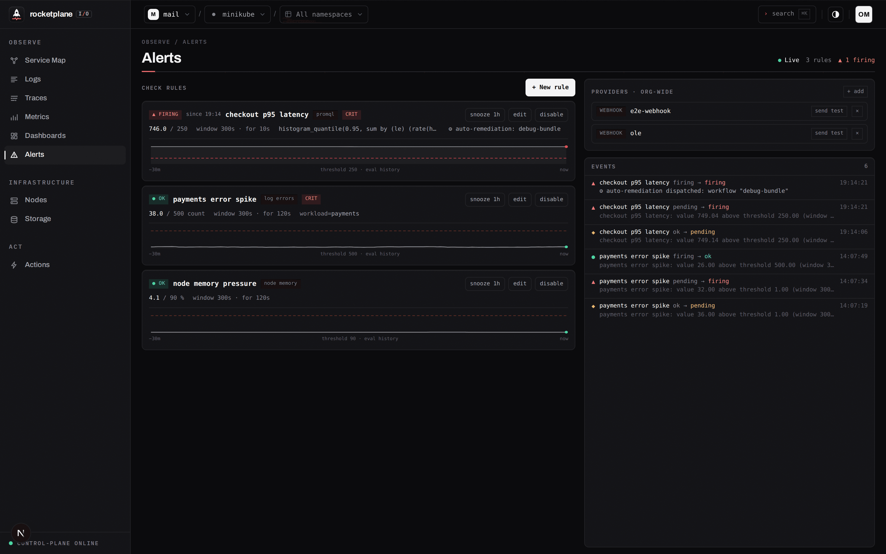
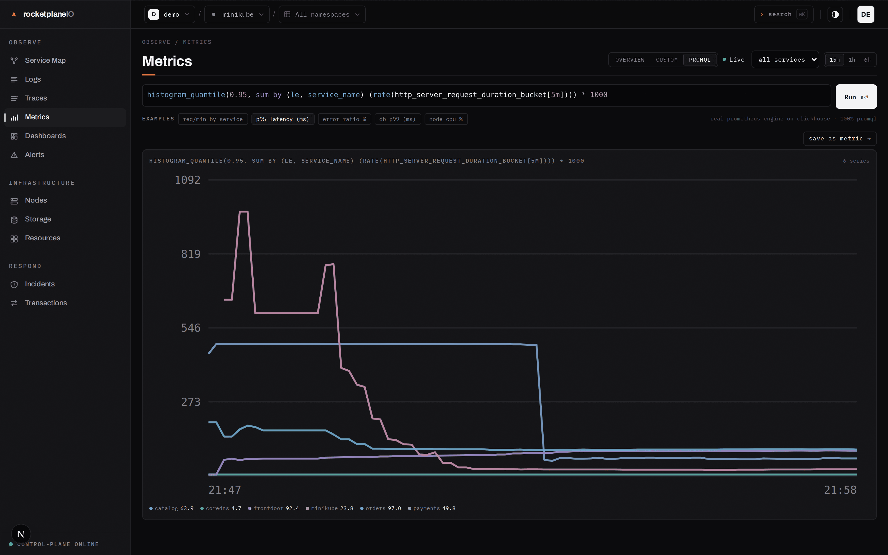
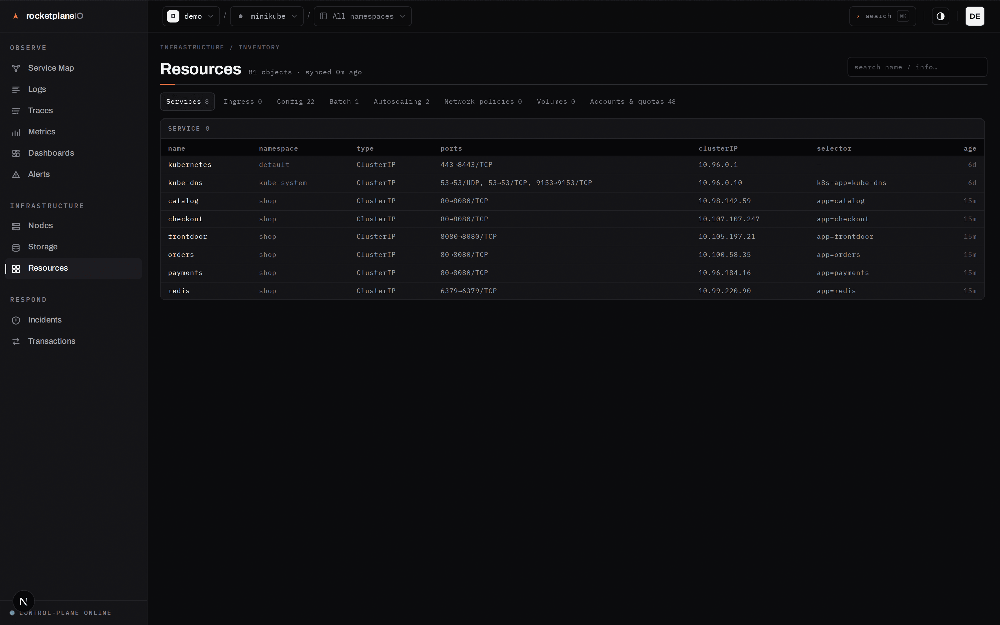
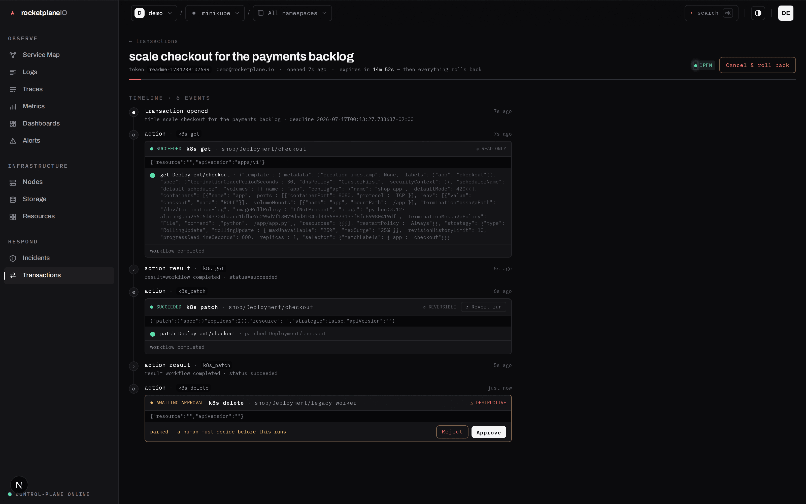
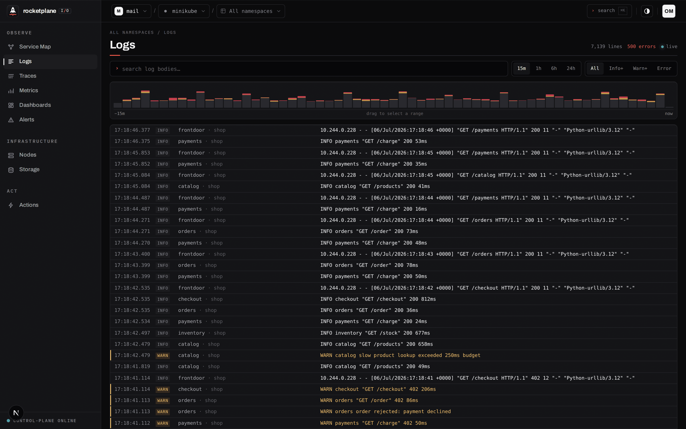
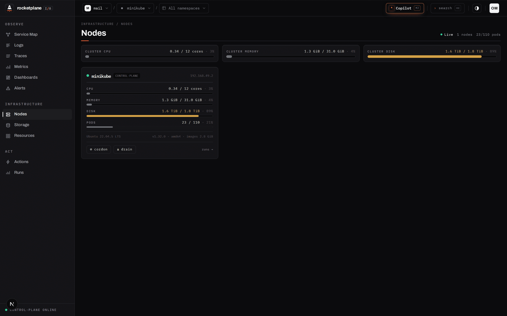

<div align="center">

<h2>Give your AI agent kubectl —<br>inside a transaction that can always roll back.</h2>

<p><b>Self-hosted · Apache-2.0 · works with Claude Code, Cursor & any MCP client · air-gapped capable</b></p>


[](LICENSE)


[**Quick start**](#quick-start) · [**Is it safe?**](#is-it-safe) · [**Under the hood**](#under-the-hood)

</div>

<br>

<a href=".github/assets/demo.mp4">
  
</a>

<br>

> **Alpha.** The full loop works end-to-end today, developed against minikube. APIs and schemas
> still change without notice — don't point it at production yet.

## Three things you don't get anywhere else

### 1 · Transactions for AI agents — full freedom, zero trust required

rocketplaneIO doesn't ship its own AI. It is the **MCP interface** your existing agent (Claude
Code, Claude Desktop, Cursor — anything that speaks MCP) connects to. The agent gets
kubectl-shaped primitives — `k8s_get` / `k8s_list` / `k8s_patch` / `k8s_apply` / `k8s_delete` /
`k8s_exec` / Starlark workflows — on **any resource, CRDs included**. It also gets the full
observability surface: eBPF traces, logs, PromQL metrics, the live service map.

The catch: **nothing mutates outside a transaction.** `begin_transaction` first — then every
change is captured durably *before* it commits. `commit` keeps it. `cancel` — or the transaction's
deadline expiring because the agent died mid-surgery — restores every before-state in reverse
order. The whole session is one auditable timeline: every read, every mutation, every approval.

Each operation is risk-classified by rocketplaneIO, not by the model:

| Level | Examples | Default policy |
|---|---|---|
| ◎ read | `k8s_get`, `k8s_list`, logs, traces, PromQL | runs immediately, no transaction needed |
| ↺ reversible | `k8s_patch`, `k8s_apply` (snapshot-backed) | runs inside the transaction |
| ◇ disruptive | `k8s_delete` on Pods/Jobs | **human approves in the UI** |
| △ destructive | any other delete, `k8s_exec`, workflows, **scale-to-0** | **human approves in the UI** |

Classification is parameter-aware (`spec.replicas: 3` is reversible; `: 0` is destructive) and
fail-closed — anything unknown lands in the strictest gate. The approval thresholds are org
policy, and approvals are session-only: **an API token can never approve its own proposals.**

**The agent proposes and acts. rocketplaneIO classifies, gates, snapshots, audits — and can
always roll back.**

### 2 · Traces for services you never instrumented

One outbound-only agent plus an eBPF DaemonSet
([OTel eBPF Instrumentation](https://github.com/grafana/beyla), née Grafana Beyla). HTTP/gRPC
spans **with cross-service context propagation — including compiled Go binaries** — plus SQL,
Redis and Kafka client spans. No SDKs, no sidecars, no code changes.


<div align="center"><sub>A real 500 on <code>GET /checkout</code>: the failure cascades frontdoor → checkout → catalog,
the exact ERROR log lines are correlated on the right. <b>No SDK in any of these services.</b>
An ERROR log line is two clicks away from this view. PromQL runs on the real Prometheus engine, embedded, on ClickHouse.</sub></div>

### 3 · Every change proves itself — or undoes itself

Mutations aren't fire-and-forget `kubectl` calls. Every operation runs over a snapshot substrate
that captures the **minimal restorable before-state the instant a change commits** — durably, on
the control plane, so even an agent crash mid-mutation stays fully restorable. The transaction is
the rollback unit: cancel it, let it expire, or hit **Revert** on a committed one days later — one
synthetic restore run replays every capture in reverse (LIFO), CRDs included.


<div align="center"><sub><b>Transactions</b> — the audit trail. What the agent read, what it
changed, who approved what, and <b>↺ revert</b> at run- or transaction-level. Cancel always
terminates — a reaper finalizes anything a dead agent leaves behind and drives the rollback to
its end.</sub></div>

## Quick start

You need Docker and a Kubernetes cluster to point it at (minikube is fine).

**1 — run the platform** (one command)

```bash
curl -fsSL https://rocketplane.io/install.sh | sh
```

That's the whole install: it downloads the compose bundle, generates real secrets,
pulls the [published images](https://github.com/olemeyer?tab=packages&repo_name=rocketplaneIO)
and starts everything. The UI comes up on **http://localhost:4173** (create the owner
account there), the control plane on `:8090`. Re-running the same command later **is**
the update path — secrets are kept, images are bumped to the newest release.

<details>
<summary>Prefer to see every step? The manual compose variant.</summary>

```bash
curl -O https://raw.githubusercontent.com/olemeyer/rocketplaneIO/main/deploy/compose/docker-compose.prod.yml
curl -o .env https://raw.githubusercontent.com/olemeyer/rocketplaneIO/main/deploy/compose/.env.example

# REQUIRED: a real session secret — the control plane refuses to start without one.
echo "RP_SESSION_SECRET=$(openssl rand -hex 32)" >> .env

docker compose --env-file .env -f docker-compose.prod.yml up -d
```

Production mode by default (no anonymous login). For a throwaway localhost trial add
`RP_ENV=dev` to `.env` to skip account setup.
</details>

**2 — connect your cluster**

Open the UI, hit **Connect cluster** — it hands you one copy-paste command that installs the
agent and the Beyla DaemonSet (a rendered `kubectl apply`, or Helm). When the service map draws
your namespaces and spans appear under Traces, you're live — without touching a line of your
code. The installer auto-detects a LAN address your cluster can dial back to; for a local
minikube that is `http://host.minikube.internal:8090`.

**3 — connect your AI agent**

Create an API token under **Settings → API keys** (role `admin` for mutations), then:

```bash
claude mcp add --transport http rocketplaneio \
  http://localhost:8090/mcp/orgs/<org>/clusters/<cluster> \
  --header "Authorization: Bearer rp_..."
```

The **Settings → MCP** tab generates this snippet (and the `.mcp.json` / Cursor variants) with
your real IDs filled in. From that moment your agent can investigate freely — and every change it
wants to make runs through a transaction you can watch, gate and roll back live under
**Transactions**.

<sub>Images ship as pinned releases (see <code>RP_VERSION</code> in <code>.env</code>);
<code>edge</code> tracks <code>main</code> for the latest unreleased changes. A platform Helm
chart is the next milestone. Want a demo workload? A Python + Redis shop behind
nginx — the one in every screenshot here — ships in
<a href="deploy/dev/">deploy/dev/</a> (<code>kubectl apply -f deploy/dev/shop-realistic.yaml -f deploy/dev/frontdoor.yaml</code>).</sub>

## Is it safe?

The section every platform team reads first:

- **Outbound-only.** The agent dials out over HTTPS; nothing connects into your cluster, nothing
  listens. Actions are *claimed* by the agent — never pushed in.
- **Auth.** In production the dev-login bypass is off: the first account is created at `/setup`, or
  you wire up Google SSO. Sessions are HMAC-signed with `RP_SESSION_SECRET`, and the control plane
  *refuses to start* with a missing or weak one — no forgeable cookies, no shipped default.
- **Network / TLS.** The control plane speaks plain HTTP on `:8090` — put it behind a TLS
  reverse proxy (or the platform Helm chart's ingress) for anything past `localhost`. The OTLP
  ingest ports `4317`/`4318` are unauthenticated by design; keep them on a trusted network
  (in-cluster or behind the proxy), not on the public internet.
- **RBAC, two blocks** ([`deploy/install.yaml`](deploy/install.yaml)): *observe* is enumerated
  read-only; *act* is deliberately broad — the generic operation set works on any kind, CRDs
  included. The guardrails are architectural, not a resource list: **no mutation outside a
  transaction, risk classification, human approval for hard operations, durable pre-mutation
  snapshots, LIFO rollback, full audit.** Delete the act block (or set `rbac.actions=false` in
  Helm) for a strictly observe-only agent.
- **Secrets:** the inventory shows names, types and key counts — never values. That restraint is
  enforced in agent code; if you'd rather enforce it with RBAC too, delete the one `secrets` rule
  and the agent degrades gracefully.
- **The agent is fenced, not trusted.** It authenticates with an org-scoped API token against
  the same RBAC you use; mutations demand an admin token AND an open transaction; disruptive and
  destructive operations park until a human approves them in the UI — and a token can never
  approve its own proposals. Every tool call, decision and result lands in the transaction
  timeline.
- **eBPF:** Beyla runs as a privileged DaemonSet (kernel ≥ 5.8 with BTF). The capture layer is
  upstream OpenTelemetry tooling — rocketplaneIO is the investigation-and-action loop on top.
- **Footprint** (measured on single-node minikube under continuous synthetic load — indicative,
  not a production benchmark): the rocketplaneIO **agent** is one lightweight pod at **~2m CPU
  and ~10Mi memory**, cluster-wide. **Beyla** is the real cost and scales with request volume —
  **~0.02 core idle, spiking to ~0.25 core under load, ~280Mi memory per node** (bounded; its
  default limit is 512Mi). One agent for the cluster, one Beyla per node.

## What else is in the box

<details>
<summary><b>Live service map · alerts with auto-remediation · PromQL on ClickHouse · full K8s inventory · approval gate · more screens</b></summary>
<br>


<sub><b>Service map</b> — topology from real eBPF traffic flows; tech logos matched from container
images; live-updating.</sub>

<br><br>


<sub><b>Alerts</b> — typed checks or PromQL conditions with <code>for</code>-durations and
sparklines. A firing rule can dispatch a remediation workflow: once per transition, fully audited,
still subject to verify-or-rollback.</sub>

<br><br>


<sub><b>PromQL</b> — the actual Prometheus evaluation engine, embedded and pointed at ClickHouse
(<a href="services/controlplane/internal/promqlx">internal/promqlx</a>); editor built on
codemirror-promql. Custom metrics are named PromQL expressions, validated at save.</sub>

<br><br>


<sub><b>Resources</b> — the complete cluster inventory (Services, Ingress, ConfigMaps, batch,
policies, volumes, quotas), synced every 60s. The same data an agent reads via
<code>k8s_list</code>.</sub>

<br><br>


<sub><b>Approvals</b> — a destructive operation proposed by an external agent parks as
<i>awaiting approval</i>; the agent waits, you decide. Approve releases it to the cluster,
reject cancels it — either way it's on the timeline forever.</sub>

<br><br>


<sub><b>Logs</b> — severity histogram, brushing, and the two-click path to the distributed
trace.</sub>

<br><br>


<sub><b>Nodes</b> — kubelet-level stats for every node: CPU, memory, disk pressure and
schedulability at a glance.</sub>

<br><br>

<sub>The UI follows a strict instrument-panel design system (RETICLE) — healthy is calm, only
anomalies speak.</sub>
</details>

## Under the hood

```
 YOUR CLUSTER   agent (Go, outbound-only, enumerated RBAC)      beyla eBPF DaemonSet
                topology · logs · inventory · action pipelines   HTTP/gRPC/Go · SQL/Redis/Kafka
                        │ HTTPS                                          │ OTLP
                        ▼                                                ▼
 CONTROL PLANE  control plane (Go, single binary)                OTel collector → ClickHouse
                MCP endpoint (Streamable HTTP) · transactions + approval gate
                API · auth/orgs · alert evaluator · operation queue · rollback reaper
                embedded Prometheus engine (PromQL → ClickHouse) · SSE broker
                        │
 DATA           PostgreSQL (state, rules, transactions, runs)  ·  ClickHouse (logs, traces, metrics)
 ACCESS         web (Next.js) — service map · transactions · logs · traces · metrics · alerts · incidents
```

The MCP endpoint lives in the control plane (`/mcp/orgs/{org}/clusters/{cluster}`, Streamable
HTTP, stateless — no sticky sessions across replicas). Read tools cover logs, traces (incl.
single-trace waterfalls and trace↔log correlation), PromQL, the service map and any Kubernetes
object; the mutating tools are the transaction-gated primitives above. Auth is a bearer API
token; every tool call reuses the exact HTTP handlers, validation and RBAC the browser uses.

<details>
<summary><b>Monorepo layout</b></summary>

```
├── agent/                      # in-cluster agent (Go): sync, logs, inventory, snapshot substrate + generic restore
├── services/controlplane/      # control plane (Go): API, auth, alerts, MCP endpoint, PromQL engine
│   └── internal/
│       ├── api/                #   REST + SSE + mcp_* (Streamable HTTP, tools, transactions, approvals)
│       ├── promqlx/            #   embedded Prometheus engine on ClickHouse
│       └── alerts/ · telemetry/ · events/ · store/ · migrations/
├── apps/web/                   # Next.js UI (RETICLE design system)
└── deploy/                     # compose (platform + dev stores), helm chart, install.yaml, demo shop
```
</details>

<details>
<summary><b>Develop from source</b></summary>
<br>

Prereqs: Go 1.25+, Node 22+ with pnpm, Docker.

```bash
git clone https://github.com/olemeyer/rocketplaneIO && cd rocketplaneIO

docker compose -f deploy/compose/docker-compose.yml up -d          # dev data stores + collector
go run ./services/controlplane/cmd/controlplane                    # control plane on :8090
cd apps/web && pnpm install && pnpm dev                            # UI on :4173
```

Building the platform images yourself (what CI publishes):

```bash
docker build -t rocketplaneio/controlplane -f services/controlplane/Dockerfile .
docker build -t rocketplaneio/web          -f apps/web/Dockerfile .
docker build -t rocketplaneio/agent        -f agent/Dockerfile .
```
</details>

## Status

| Works end-to-end today | On the roadmap |
|---|---|
| MCP endpoint: transactions, classification, approval gate | Tagged releases + platform Helm chart |
| LIFO snapshot rollback on cancel/expiry — CRDs included | Hosted demo |
| eBPF traces incl. compiled Go, log→trace correlation | Production-scale overhead benchmarks |
| Transaction timeline, revert at run and transaction level | Multi-user RBAC hardening |
| Alerts with auto-remediation (audited as transactions) | Namespace-scoped transaction policies |
| PromQL + custom metrics on ClickHouse, full K8s inventory | |
| Published multi-arch images (`edge`) + agent install.yaml | |

## Contributing

Reports from real clusters are the contribution we want most —
[open an issue](https://github.com/olemeyer/rocketplaneIO/issues). See
[CONTRIBUTING.md](CONTRIBUTING.md). If this resonates, a star helps others find it.

## License

[Apache-2.0](LICENSE).

---

<div align="center">
<sub>Built with Go, Next.js, eBPF and ClickHouse · rocketplaneIO</sub>
</div>
