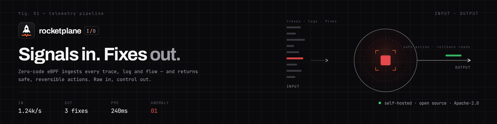
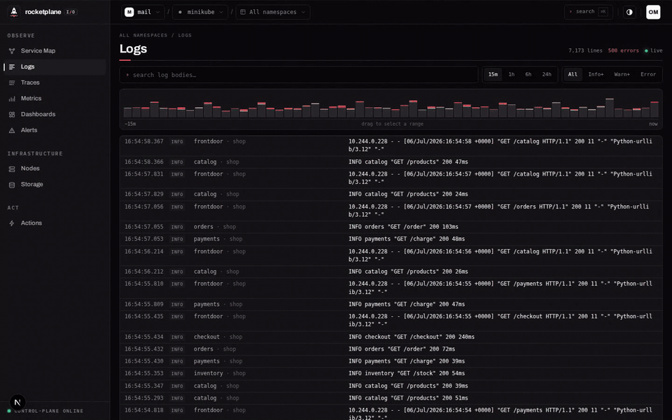
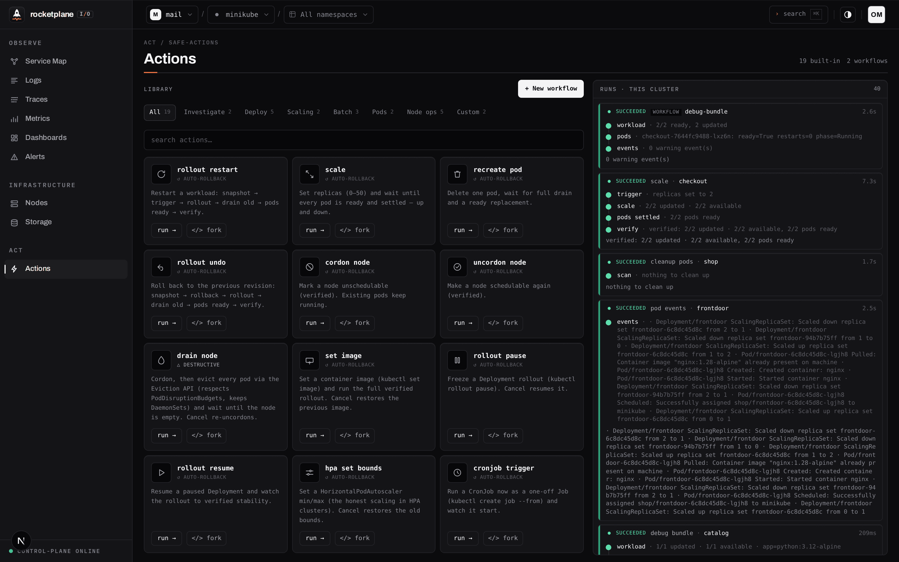

<div align="center">

<picture>
  <source media="(prefers-color-scheme: dark)" srcset=".github/assets/banner-dark.png">
  <source media="(prefers-color-scheme: light)" srcset=".github/assets/banner-light.png">
  
</picture>

<h3>eBPF traces for services you never instrumented.<br>
Alerts that dispatch remediations that verify themselves — or roll back.</h3>


[](LICENSE)


[**Quick Start**](#quick-start--from-source-alpha) · [**Five-minute tour**](#five-minute-tour) · [**How an action runs**](#how-an-action-runs) · [**Security**](#will-it-break-my-cluster) · [**Architecture**](#architecture) · [**Status**](#status--roadmap)

</div>

<br>

<div align="center">
  
  <br><sub>An ERROR log line → its distributed trace, in two clicks. Every span here comes from eBPF —
  none of these services contain a tracing SDK.</sub>
</div>

> **Alpha.** The full loop — connect, observe, investigate, alert, remediate — works end-to-end
> today (developed against minikube; reports from real clusters are the contribution we want
> most). APIs, schemas and UI still change without notice.

## Why rocketplaneIO

Every observability tool ends at the same place: a dashboard and a page. The fixing happens
somewhere else — in a terminal, from a runbook, from memory, under pressure.

rocketplaneIO closes that loop:

- **See** — one outbound-only agent plus an eBPF DaemonSet ([Grafana Beyla](https://github.com/grafana/beyla),
  now OpenTelemetry eBPF Instrumentation). Traces for services you never instrumented, including
  compiled Go binaries. No SDKs, no sidecars, no code changes.
- **Understand** — a log line to the full distributed trace in two clicks. PromQL evaluated by the
  Prometheus engine itself, embedded and pointed at ClickHouse.
- **Act** — a firing alert can dispatch a remediation workflow. Every action is a pipeline that
  checks the cluster actually converged — and rolls itself back when it doesn't.

**Where it sits:** like [Coroot](https://github.com/coroot/coroot) and
[SigNoz](https://github.com/SigNoz/signoz), it's eBPF + ClickHouse.
[Robusta](https://github.com/robusta-dev/robusta) reacts to alerts too — the difference here
is that every action must *prove convergence at pod level or roll itself back*: deterministic,
human-written workflows, no LLM in the loop.

## What you get

- **Safe actions** — restart, scale, drain, rollout-undo as pipelines: trigger → observe → verify
  at pod level. Cancel or timeout rolls back automatically.
- **Auto-remediation** — a firing alert dispatches a workflow, once per transition, fully audited.
- **Starlark workflows** — automate what an operator does by hand; typed parameters render as
  forms, source is compiled and validated at save.
- **Zero-instrumentation traces** — HTTP/gRPC with cross-service context propagation (including
  compiled Go, via uprobes), plus SQL, Redis and Kafka client spans.
- **Live service map** — topology from real traffic flows, tech logos auto-matched from
  container images (170+ known), updates pushed over SSE instead of polling.
- **PromQL on ClickHouse** — the Prometheus evaluation engine, embedded
  ([`internal/promqlx`](services/controlplane/internal/promqlx)); editor built on the official
  [codemirror-promql](https://github.com/prometheus/codemirror-promql) with autocomplete and
  linting. Custom metrics are named PromQL expressions — a broken one fails at save time
  (parse + probe run).
- **Alerts** — typed checks or PromQL conditions, `ok → pending → firing` with `for`-durations,
  webhook/Slack/email, per-rule sparklines, snooze.
- **Infrastructure** — nodes with kubelet-level stats, PVC usage, cordon/drain from the UI.

## See it work


<sub><b>The service map, drawn from eBPF traffic flows.</b> Nginx, Go and Python matched from
the container images; edges carry the live flows between workloads.</sub>

<br><br>


<sub><b>A real 500 on <code>GET /checkout</code> from the demo shop.</b> The failure cascades
frontdoor → checkout → catalog; the exact ERROR log lines of the failing service are correlated on
the right. No SDK in any of these services.</sub>

<br><br>


<sub><b>A checkout-p95 PromQL rule, currently firing</b> — the card carries the evaluator's value
history against the threshold line; the event feed on the right records every
<code>ok → pending → firing</code> transition and the auto-remediation dispatch.</sub>

<details>
<summary><b>More screens: actions catalog, PromQL editor, logs, nodes</b></summary>
<br>


<sub><b>Actions</b> — built-in catalog plus custom Starlark workflows; every run on the right is a
verified pipeline with pod-level checks.</sub>

<br><br>


<sub><b>PromQL</b> — <code>histogram_quantile</code> over eBPF-captured latency histograms,
evaluated by the embedded Prometheus engine on ClickHouse.</sub>

<br><br>


<sub><b>Logs</b> — severity histogram, brushing, and the two-click path to the trace shown in the
GIF above.</sub>

<br><br>


<sub><b>Infrastructure</b> — kubelet-level node stats, cordon/drain as verified actions.</sub>

<br><br>

<sub>The UI follows a strict instrument-panel design system (RETICLE) — healthy is calm,
only anomalies speak.</sub>
</details>

## How an action runs

Actions are not fire-and-forget `kubectl` calls. Built-ins and custom workflows alike run as
pipelines — **trigger → observe → verify** — and only report success when the cluster actually
converged. This is a scale workflow exactly as you write it in the actions editor:

```python
ns = args["namespace"]
name = args["name"]
target = int(args["replicas"])

step("snapshot")
before = k8s.get(ns, "Deployment", name)["desired"]
report("current replicas: %d" % before)

step("scale to %d" % target)
k8s.scale(ns, "Deployment", name, target)
ok = wait_ready(ns, "Deployment", name, timeout=120)

if not ok:
    step("rollback")
    k8s.scale(ns, "Deployment", name, before)
    wait_ready(ns, "Deployment", name, timeout=120)
    fail("scale to %d did not settle - rolled back to %d" % (target, before))

step("verify")
report("settled at %d replicas" % target)
```

Workflows are Starlark (a Python dialect built for embedding): deterministic, human-written,
no LLM in the loop. Parameters are typed and render as a form; the source is compiled at save,
so a broken workflow can't be stored. Cancel or timeout triggers rollback from the engine's
undo stack. An alert rule can dispatch any of these when it fires — that's the whole
auto-remediation story: **not an AI that guesses, not a bare one-liner — a pipeline that
proves convergence or undoes itself.**

## Will it break my cluster?

The section every platform team reads first, so here it is early:

- **Outbound-only.** The agent dials the control plane over HTTPS; nothing connects into your
  cluster, nothing listens. Actions are *claimed* by the agent via polling — they are never
  pushed in.
- **Enumerated RBAC, split in two blocks** ([`deploy/install.yaml`](deploy/install.yaml)):
  *observe* is read-only (`get/list/watch` on namespaces, pods, services, nodes, PVCs, events,
  kubelet stats via `nodes/proxy`); *act* holds exactly the write verbs safe actions need
  (`patch` on workload controllers and nodes, `delete` on pods, `create` on `pods/eviction` for
  PDB-respecting drains). Delete the act block — or set `rbac.actions=false` in the Helm chart —
  for a strictly observe-only agent. No wildcard, no cluster-admin, and no RBAC for Secrets at all.
- **What leaves the cluster:** workload/pod/node/PVC metadata, container logs, and
  eBPF-captured spans and metrics (OTLP). Nothing else — the agent can't read what it has no
  RBAC for.
- **eBPF requirements:** Beyla runs as a privileged DaemonSet and needs a Linux kernel ≥ 5.8
  with BTF (default since 5.14). Capture is [Grafana Beyla](https://github.com/grafana/beyla),
  since donated to OpenTelemetry as OTel eBPF Instrumentation — rocketplaneIO is the
  investigation and action loop on top, not homegrown eBPF.

## Quick Start — from source (alpha)

No published container images yet — you run the platform from source (that's the alpha part;
images and a platform Helm chart are next, see [roadmap](#status--roadmap)). With Go 1.25+,
Node 22+/pnpm and Docker installed, expect **about ten minutes to your first trace**:

```bash
git clone https://github.com/olemeyer/rocketplaneIO && cd rocketplaneIO

# 1 — data stores + OTLP collector (Postgres, ClickHouse — defaults just work)
docker compose -f deploy/compose/docker-compose.yml up -d

# 2 — control plane on :8090
go run ./services/controlplane/cmd/controlplane &

# 3 — web UI on :4173
pnpm install && pnpm dev
```

Open **http://localhost:4173**, create the owner account (local email+password; Google SSO is
optional config), then hit **Connect cluster** — it hands you a single copy-paste `kubectl`
command that installs the agent and the Beyla DaemonSet.

**Alpha gap:** the agent image isn't on a public registry yet ([roadmap](#status--roadmap)).
For a local minikube, build it into the cluster first and point the control plane at it:

```bash
docker build -t rocketplane/agent:dev -f agent/Dockerfile . && minikube image load rocketplane/agent:dev
# control plane env: RP_AGENT_IMAGE=rocketplane/agent:dev
```

You'll know it worked when the service map draws your namespaces and the first spans appear
under Traces — without touching a line of your code.

## Five-minute tour

An empty minikube doesn't show off an observability tool, so the repo ships a realistic
demo — the workload the screenshots above were taken from:

```bash
# a Python + Redis shop behind an nginx frontdoor, generating real traffic, errors and slow queries
kubectl apply -f deploy/dev/shop-realistic.yaml -f deploy/dev/frontdoor.yaml
```

(The Go service in the trace screenshots lives in [`deploy/dev/inventory-go`](deploy/dev/inventory-go)
— optional, needs a locally built image.)

1. Watch the **service map** light up: frontdoor → checkout → payments/orders/catalog → redis,
   with tech logos auto-matched.
2. Open **Logs**, click an `ERROR` from checkout — then *Traces around this log*. Two clicks,
   and you're inside the distributed trace with the failing span focused and its logs correlated
   (the GIF at the top of this page).
3. Open **Alerts**, create a PromQL rule on checkout p95 with a low threshold, and watch it go
   `ok → pending → firing` — then attach a remediation workflow (create one from the template
   library under Actions) and watch the firing rule dispatch it under Actions → runs.

## Architecture

```
 YOUR CLUSTER   ┌──────────────────────────────────────────────────────────┐
                │  agent — outbound-only, enumerated RBAC                   │
                │  topology & pod sync · log shipping · action claims       │
                │  beyla eBPF DaemonSet — HTTP/gRPC/Go · SQL/Redis/Kafka    │
                └───────┬──────────────────────────────────┬───────────────┘
                        │ agent ──HTTPS──▶ control plane   │ beyla ──OTLP──▶ collector ──▶ ClickHouse
                        ▼                                  ▼
 CONTROL PLANE  ┌──────────────────────────────────────────────────────────┐
                │  control plane (Go, single binary)                        │
                │  API · auth/orgs · alert evaluator · action queue         │
                │  embedded Prometheus engine — PromQL → ClickHouse         │
                │  SSE event broker — push-invalidated live UI              │
                └──────────┬──────────────────────┬────────────────────────┘
                           ▼                      ▼
 DATA              PostgreSQL              ClickHouse
                   state · orgs · rules    logs · traces · metrics (OTel)

 ACCESS            web (Next.js) ──▶ control-plane API · live via SSE
```

- **Agent** (`agent/`) — Go binary in the cluster. Syncs topology (deployments, pods, nodes,
  PVCs with kubelet stats), ships logs, and executes claimed actions through step pipelines
  with verification and rollback. Strictly outbound.
- **Control plane** (`services/controlplane/`) — Go, single binary. Multi-org auth, cluster
  enrollment, telemetry queries, the alert evaluator (typed + PromQL rules, auto-remediation
  dispatch), the Starlark engine's control side, and an SSE broker so open views update on push.
- **Web** (`apps/web/`) — Next.js App Router: service map, logs, traces, metrics with the
  PromQL editor, alerts, actions, infrastructure.
- **ClickHouse** — OTel logs, traces and metrics; PromQL runs against it through the embedded
  engine. **PostgreSQL** — control-plane state: orgs, clusters, rules, workflows, actions.

<details>
<summary><b>Monorepo layout</b></summary>

```
├── agent/                     # in-cluster agent (Go) — sync, log shipping, action pipelines
├── services/controlplane/     # control plane (Go) — API, auth, alerts, actions, PromQL
│   └── internal/
│       ├── api/               #   HTTP handlers (REST + SSE + Prometheus-compatible API)
│       ├── alerts/            #   evaluator: state machine, providers, auto-remediation
│       ├── promqlx/           #   embedded Prometheus engine on ClickHouse
│       ├── telemetry/         #   ClickHouse queries (logs, traces, RED, infra metrics)
│       ├── events/            #   SSE broker (invalidation signals)
│       ├── store/ · model/    #   PostgreSQL access + domain types
│       └── migrations/        #   SQL migrations (applied at boot)
├── apps/web/                  # Next.js dashboard (App Router, Tailwind)
├── packages/ui/               # shared design tokens
├── deploy/
│   ├── compose/               #   local data stores + OTel collector
│   ├── helm/rocketplane-agent/#   agent Helm chart
│   ├── install.yaml           #   Helm-free agent install (kubectl)
│   └── dev/                   #   demo shop workload, Beyla manifest
```
</details>

## Status & roadmap

| Works end-to-end today | Not yet |
| --- | --- |
| eBPF traces incl. compiled Go, with context propagation | Published container images |
| Service map, logs → trace investigation, three trace views | Platform Helm chart (agent chart exists) |
| PromQL + custom metrics on ClickHouse | Hosted demo |
| Alerts with auto-remediation dispatch | Measured agent/Beyla overhead numbers |
| Safe actions with verify + auto-rollback, Starlark workflows | Multi-user RBAC hardening |
| Nodes/PVC view, cordon/drain from the UI | |

Alpha means alpha: interfaces change without notice, and you should not point this at a
production cluster yet.

## Contributing & community

Issues and feedback are very welcome — especially reports from real clusters:
[open an issue](https://github.com/olemeyer/rocketplaneIO/issues). For anything else, see
[CONTRIBUTING.md](CONTRIBUTING.md). If you got this far and it resonates, a star helps others
find it.

## License

rocketplaneIO is open source under the [Apache License 2.0](LICENSE).

---

<div align="center">
<sub>Built with Go, Next.js, eBPF and ClickHouse · rocketplaneIO</sub>
</div>
